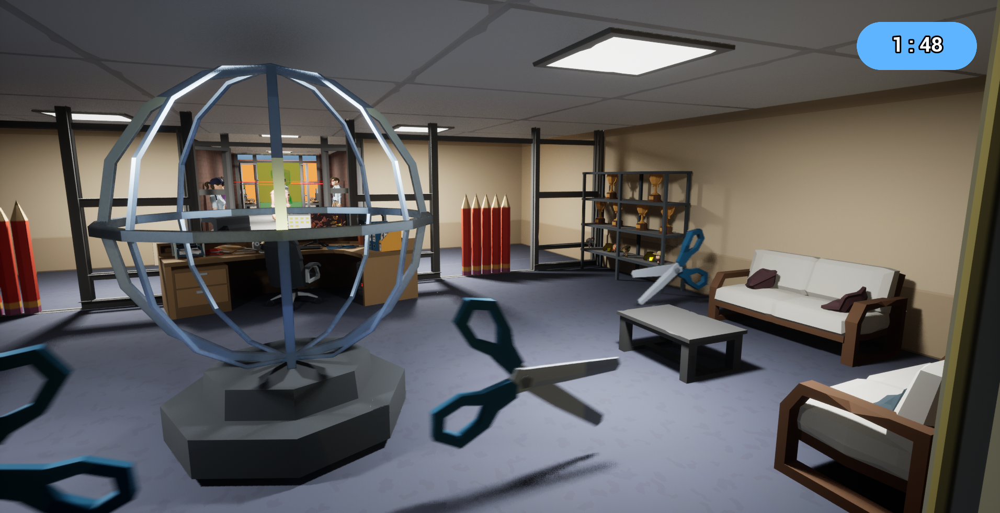
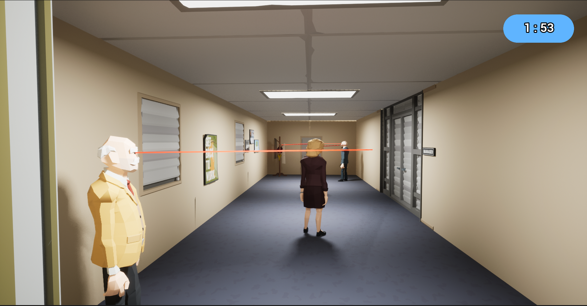
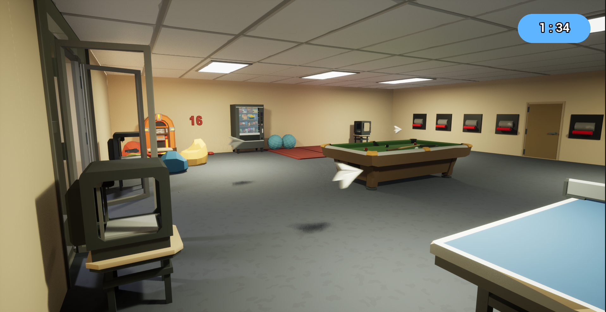

# EscapeFromTheOffice

## Unreal Engine 5.1 Blueprint Project
Escape From The Office is a first-person office-themed puzzle game.

It is not a complete project yet.

### Story
Its story based on one of the developer's dream. 
It is about the dream he has after falling asleep as the end time of the work approaches. 
He is dreaming about escape from the office but he has to solve the puzzles and be careful about traps. 
His office is at third floor. After three floors(levels) are completed, he wakes up and realizes that was just a dream.

### Puzzles
- On the third and second floor, there are puzzles in everywhere except halls.
- The player has to find a way to open different type of doors.

### Doors
- There are different types of doors to make different puzzles.
- They are key door, password door, pressure plate door and lever doors.
- There is also reality portal which teleports the character to his room. He must go there to solve one of the puzzle.

### Traps
- There are traps in the halls of both the first and second floors and on the third floor.
- To match the theme, traps are patrolling scissors, a printer that shoots paper planes, pencils as a spike traps and laser eyed bosses.

### Level Ends
- The character can reach the elevator which means he passed the floor.
- He can be caught in traps which means he fails.
- When time's up, he also fails.
- When he reachs the end of the first floor(last level), game ends.

  

### TODO 
- Pause Game and Pause Menu
- Applying saved player preferences to the gameplay

  

