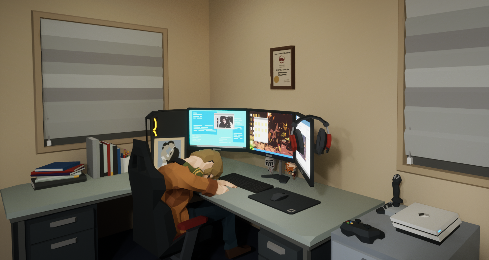

# EscapeFromTheOffice

## Unreal Engine 5.1 Blueprint Project
Escape From The Office is a first-person office-themed puzzle game.
### Story
Its story based on one of the developer's dream. 
It is about the dream he has after falling asleep as the end time of the work approaches. 
He is dreaming about escape from the office but he has to solve the puzzles and he has to be careful about traps. 
His office is at third floor. After three floors(levels) are completed, he wakes up and he realizes it was all a dream. 

### Puzzles
- In first and second floor, there are puzzles in everywhere except halls.
- Player has to find a way to open different type of doors.

### Doors
- There are different type of doors to make different puzzles.
- They are key door, password door, pressure plate door and lever doors.
- There are also reality portal which teleport the character to his room. He has to go there to solve one of the room.

### Traps
- In the first and second floors' halls and third floor, there are traps.
- To match the theme, traps are patrolling scissors, a printer that shoots paper planes, pencils as a spike traps and laser eyed bosses.

